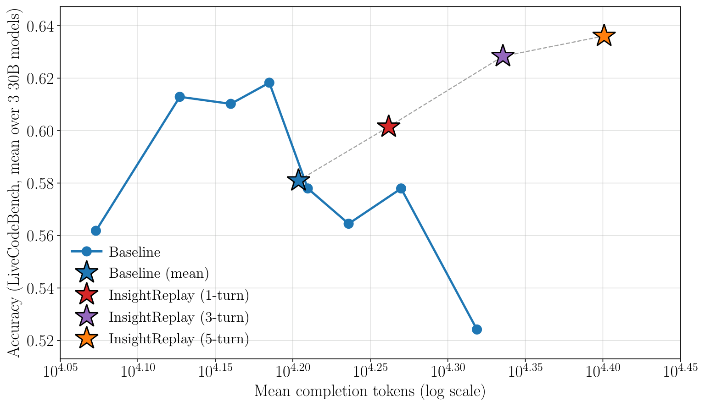
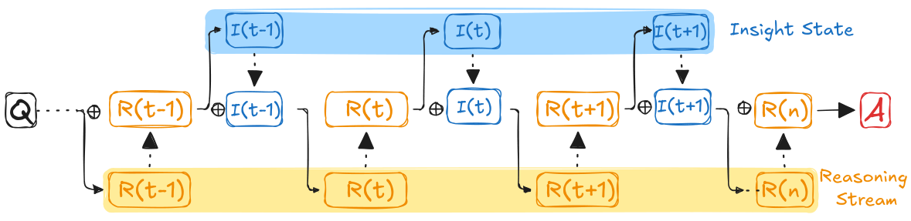
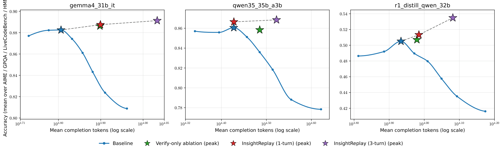
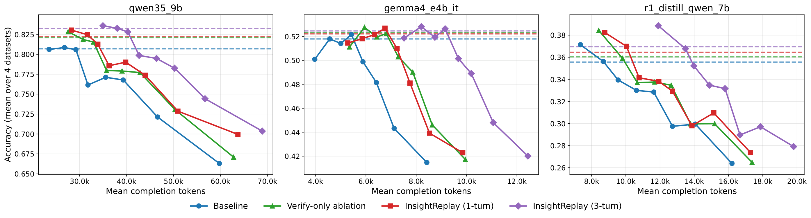
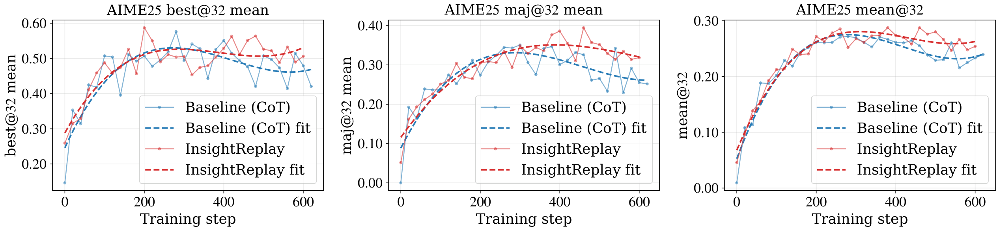

<div align="center">

# Stateful Reasoning via Insight Replay

**Periodically extract critical insights from a model's reasoning trace and replay them near the active generation frontier — keeping insights accessible as the chain scales.**

[](https://simular-ai.github.io/InsightReplay/)
[](#)
[](#license)
[](https://www.python.org/)



<sub>Accuracy vs. mean tokens for **Baseline** (standard CoT) and **InsightReplay** (1, 3, 5 replay rounds), averaged over three 30B-tier models on the LiveCodeBench v5 subset. InsightReplay shifts the accuracy peak to longer chains and raises peak performance.</sub>

</div>

---

## TL;DR

As a chain-of-thought grows, a model's attention to **critical insights** produced earlier in the trace gradually weakens — making them progressively less accessible when they are most needed. **InsightReplay** fixes this by periodically extracting these insights and replaying them near the active generation frontier.

Across the full **2 × 3 × 4** grid of {8B, 30B} × {Qwen3.5, DeepSeek-R1-Distill-Qwen, Gemma-4} × {AIME, HMMT, GPQA Diamond, LiveCodeBench v5}:

- ✅ Gains on **all 24 settings** over standard CoT
- 📈 **+1.65** averaged accuracy improvement
- 🚀 **+9.2** points peak gain (R1-Distill-32B, LiveCodeBench v5)

## Method

<p align="center">
  
</p>

InsightReplay treats reasoning as a **stateful** process. At any point, the reasoning *state* is the cumulative set of *insights* the model has generated so far — compressed abstractions of prior reasoning. Periodically, the model extracts new insights and replays them near the active generation frontier, so critical intermediate content remains accessible despite the natural attention decay that comes with long chains.

## Results

### Inference-time

Applying InsightReplay as a **sampling-time** decoder on already-trained models. The pipeline at the repo root (`./run_all.sh`) reproduces these numbers.

#### 30B-tier models


#### 8B-tier models


### Training-time

Running InsightReplay as the **rollout strategy during RL training** (GRPO+DAPO on Qwen3-4B-Base). The recipe lives under [`training/`](training/).

<p align="center">
  
</p>

<sub>AIME-2025 validation accuracy (best@32, maj@32, mean@32) over RL training steps, comparing baseline GRPO vs InsightReplay-rollout GRPO on Qwen3-4B-Base + DAPO-Math-15k. Dashed lines are fitted trends.</sub>

## Repository Layout

```
.
├── run_all.sh                        # one-shot driver (all 4 methods, all cells)
├── data/                             # benchmark jsonl files
│   ├── aime.jsonl
│   ├── gpqa_diamond_test.jsonl
│   ├── hmmt.jsonl
│   └── livecodebench_v5.jsonl        # ~111 MB, tracked via Git LFS
├── scripts/
│   ├── run_sampling.py               # sampler (baseline + multi-turn extract-and-replay)
│   ├── prompt.py                     # model / dataset configs and prompt builders
│   ├── config.py                     # default hyperparameters (env-var overridable)
│   ├── grade_livecodebench.py        # LCB code grader
│   ├── compare_baseline_insightreplay.py  # row-level A/B reporter
│   ├── audit_results.py              # cross-method consistency check
│   ├── rebuild_summaries.py          # rebuild summary CSVs from raw jsonl
│   ├── regrade.py                    # in-place regrade
│   ├── repair_no_answer.py           # patch records with empty <Answer>
│   ├── sample_eval_livecodebench.py  # one-off LCB sanity tester
│   └── math_verify_util.py           # math equivalence checker (LaTeX answers)
├── assets/                           # figures used in this README
├── training/                         # RL training recipe (bundled verl + InsightReplay agent loop)
└── outputs/                          # generated at run time
```

Inside `outputs/`, results are organised as `<model>__<dataset>__<suffix>/raw_<suffix>.jsonl`, where `<suffix>` is one of `unlimited` (baseline), `verify_only`, `insightreplay` (1-turn), or `insightreplay_3turns` (3-turn).

## Datasets

The `data/` directory ships with `aime.jsonl`, `gpqa_diamond_test.jsonl`, `hmmt.jsonl`, and `livecodebench_v5.jsonl`. The LiveCodeBench file is ~111 MB and is tracked via [Git LFS](https://git-lfs.com); install `git-lfs` before cloning, or run `git lfs pull` after cloning to fetch it.

## Requirements

- Python 3.10+
- A vLLM-compatible GPU box. The driver assumes 8 GPUs (TP=1×DP=8 for the 8B tier, TP=2×DP=4 for the 30B tier); adjust by setting `FBE_GPU_IDS` and the per-model `tp_size` field in `scripts/prompt.py`.
- Docker — required by the LiveCodeBench grader for sandboxed code execution. Skip if you only run AIME / GPQA / HMMT.
- Model weights — by default the driver passes the HuggingFace repo id to vLLM, which resolves it via the HF cache. To use a pre-downloaded local snapshot, export `FBE_MODEL_PATH_<KEY>` (e.g. `FBE_MODEL_PATH_QWEN35_35B_A3B=/abs/path/to/snapshot`).

## Install

```bash
# (optional) fresh virtualenv
python3 -m venv .venv && source .venv/bin/activate

# Python deps. vLLM pulls in torch / cuda runtime; install separately if
# you need a torch build matched to a non-default CUDA version.
pip install -r requirements.txt
```

If you plan to run LiveCodeBench, also pull the grader's sandbox image once before launching:

```bash
docker pull python:3.10-slim
```

## Quick Start

```bash
./run_all.sh
```

That's it. The driver:

1. starts vLLM once per model,
2. iterates baseline → verify_only → 1-turn → 3-turn over `aime`, `hmmt`, `gpqa`, `livecodebench` for that model,
3. auto-grades any `livecodebench` outputs in place,
4. cleans up vLLM and moves to the next model.

Each cell is **idempotent** — if its output jsonl already exists the step is skipped. To rerun a cell, delete its directory under `outputs/`.

## Tuning the Run

The driver respects these environment variables:

| Variable | Default | Notes |
|---|---|---|
| `FBE_VLLM_PORT` | `8270` | port vLLM binds to |
| `FBE_GPU_IDS` | `0,1,2,3,4,5,6,7` | GPUs visible to vLLM |
| `FBE_GPU_MEM` | `0.92` | vLLM `--gpu-memory-utilization` |
| `FBE_NUM_SAMPLES` | `16` | samples per problem |
| `FBE_BATCH_SIZE` | `128` | HTTP batch size into vLLM |
| `FBE_MAX_TOKENS` | `60000` | per-sample generation cap |
| `FBE_INSIGHTREPLAY_EXTRACT_MAX_TOKENS` | `10000` | extractor budget |
| `FBE_INSIGHTREPLAY_CONT_MAX_TOKENS` | `30000` | continuation budget |
| `FBE_GRADE_WORKERS` / `FBE_GRADE_TIMEOUT` | `8` / `20` | LCB grader parallelism / per-test timeout |

To run a single model only, comment out the other `run_model …` lines at the bottom of `run_all.sh`. To skip a method, delete its call inside `run_model`'s inner loop.

## Outputs

After a successful run you get, per model × dataset cell:

```
outputs/<model>__<dataset>__<suffix>/
    raw_<suffix>.jsonl                 # one record per sample
    run_<suffix>.log                   # sampler stdout
    grader.log                         # LCB grader (if applicable)
    compare.log                        # 1-turn only: bucket transitions vs baseline
    bucket_samples/                    # 1-turn only: example records from each bucket
```

and aggregate CSV summaries:

```
outputs/summary_baseline.csv
outputs/summary_verify_only.csv
outputs/summary_insightreplay.csv
outputs/summary_insightreplay_3turns.csv
```

with columns `model,dataset,method,n,n_correct,acc,avg_tok,max_tok,avg_steps,out_dir`.

## Training

The top-level pipeline above runs the **inference-time** InsightReplay evaluation. The **RL training** recipe — the GRPO+DAPO run on Qwen3-4B-Base that produced the paper's RL results — lives separately under [`training/`](training/), with its own bundled (slimmed) copy of [verl](https://github.com/verl-project/verl) and a dedicated conda env. See [`training/README.md`](training/README.md) for the two-env reproduce flow, dataset prep, the 128-GPU cluster launchers (`baseline_cluster.py` / `insight_cluster.py`), and a description of how the InsightReplay agent loop slots into verl's rollout pipeline.

## Citation

If you find InsightReplay useful, please cite our work:

```bibtex
@article{lei2026insightreplay,
  author = {Lei, Bin and Ding, Caiwen and Yang, Jiachen and Li, Ang and Wang, Xin Eric},
  title  = {Stateful Reasoning via Insight Replay},
  year   = {2026},
}
```

## License

Released under the **Apache License 2.0** — see [`LICENSE`](LICENSE) for the full text. The bundled `training/verl/` subtree is upstream verl, also Apache-2.0, with its own `LICENSE` and `Notice.txt` preserved next to its sources.

## Acknowledgements

Built on top of [vLLM](https://github.com/vllm-project/vllm) for fast inference, [verl](https://github.com/verl-project/verl) for the RL training pipeline (see [`training/`](training/)), and the public benchmarks [AIME](https://maa.org/maa-invitational-competitions/), [HMMT](https://www.hmmt.org/), [GPQA Diamond](https://github.com/idavidrein/gpqa), and [LiveCodeBench](https://github.com/LiveCodeBench/LiveCodeBench).
